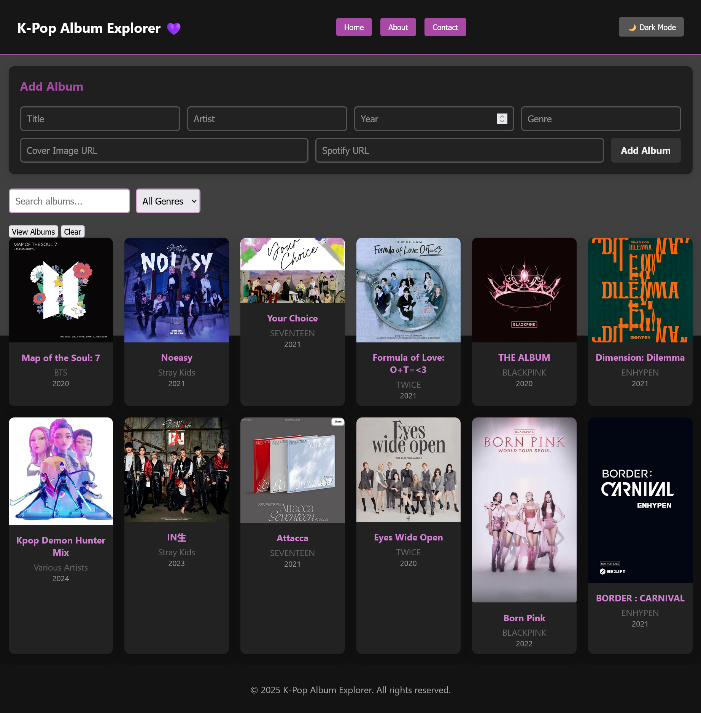

# kpop-album
# 🎵 K-Pop Album Explorer

An interactive web app to browse and discover K-Pop albums with cover images, search, filtering, and direct Spotify integration.

## Preview

## ✨ Features

- **Dynamic Album Display:** Loads album data from `db.json`.
- **Search & Filter:** Instantly filter by album title, artist, or genre.
- **Clickable Albums:** Click any album to open its Spotify page.
- **Dark Mode:** Toggle dark mode for comfortable viewing.
- **Responsive Design:** Works on desktop and mobile.

**HTML**
- Provides the base layout with containers for albums and navigation.

**CSS**
- Styles the album grid, cards, navbar, dark mode, and background.
- Includes an optional overlay for background softening.

**JavaScript**
- Fetches album data dynamically.
- Creates and injects album cards.
- Adds event listeners for filtering and navigation.
- Handles dark mode toggle.
- Opens Spotify links when albums are clicked.

---

## 🌟 Technologies

- HTML
- CSS
- JavaScript (Vanilla)

---

## 💜 Credits

- Album covers and data from Spotify.
- Inspired by K-Pop fandom.

---

## 📄 License

This project is open-source.
 ## Author
 Asha Mohamed
